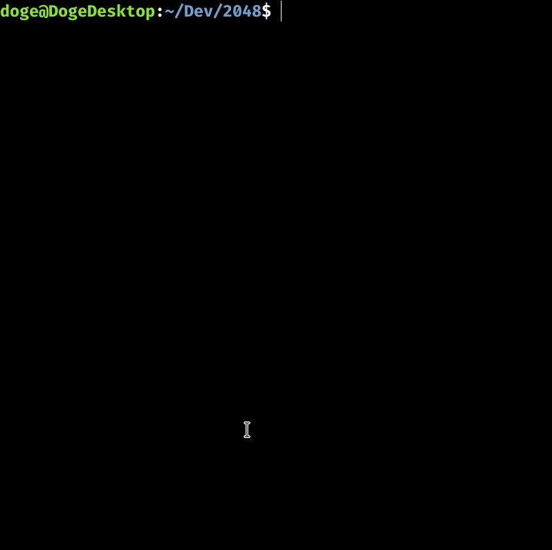

# 2048

## Demo
<!--  -->


## Description
The objective is simple: get to the 2048 tile!

- Use the arrow keys to move all tiles.
- When two tiles with the same number touch, they merge into one.

## Setup
1. Install SDL2 [here](https://www.libsdl.org/download-2.0.php).
2. Clone the repository.
3. Type the following in the directory of the repository.
```
./compile.sh
./main.out
```
